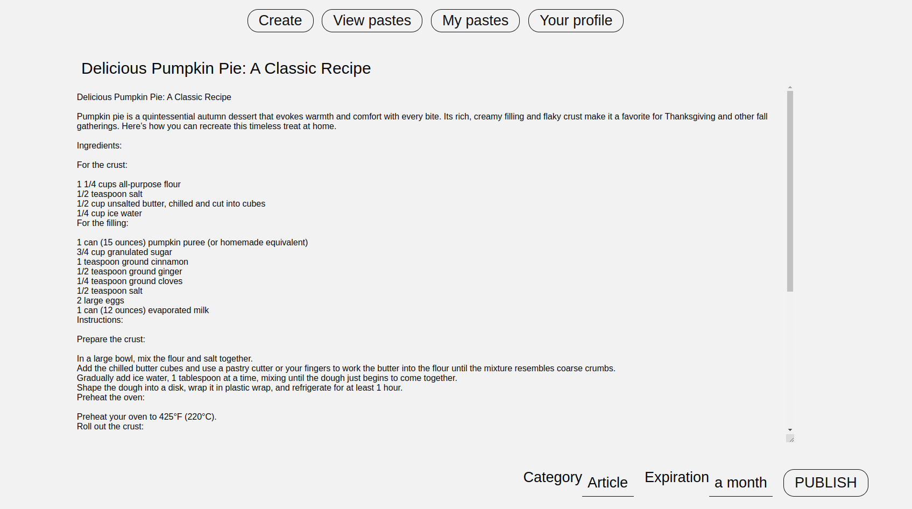
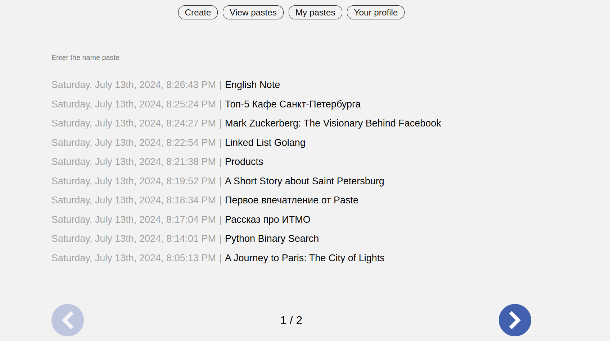

# Paste Project

## About Project

This project is a platform for sharing text posts - **pastes**. It features a simple and minimalistic design. Here you can create, read, update, delete, and share _pastes_. Our project is similar to PasteBin and Telegraph.

But what makes this project better than other simple CRUD-apps and pet-projects? **The answer is realization!**

## Technologies Used

We are a [team of three developers](#our-team), and we utilized modern technologies in our development process to ensure high performance, scalability, and maintainability. Our tech stack includes:

- **Frontend:** Vue.js, Node.js, NPM
- **Styling:** HTML, SCSS, JavaScript
- **Backend:** GoLang (built following **SOLID** and **REST** principles)
- **Load Balancer:** NGINX
- **Database:** PostgreSQL
- **Message Broker:** RabbitMQ
- **Cache:** Redis
- **SMTP:** Simple Mail Transfer Protocol for email notifications
- **Version Control:** Git with GitHub
- **Continuous Integration:** GitHub Actions and GitHub Pages
- **Containerization:** Docker, Docker Compose
- **Documentation:** Swagger
- **Migrations:** Docker image `migrate/migrate:latest`

We also implemented a microservice architecture, which allows us to break down the application into smaller, independent services that can be developed, deployed, and scaled individually.

These technologies enable us to build a robust, efficient, and scalable application that meets current industry standards and best practices.

## Project Structure


You can find all the elements of our application on GitHub and DockerHub:

### Design

- [GitHub - Design](https://github.com/ivanbarbashin/Paste)

### Frontend

- [GitHub - Frontend](https://github.com/Alex2aA/vue-cli-pasteapi-client)
- [DockerHub - Frontend](https://hub.docker.com/r/instead666/vue-cli-pasteapi-client)

### API

- [GitHub - API](https://github.com/zhukovrost/pasteAPI/)
- [DockerHub - API](https://hub.docker.com/r/zhukovrost/pasteapi)

### Email Sender Microservice

- [GitHub - Email Sender](https://github.com/zhukovrost/pasteAPI-email-sender)
- [DockerHub - Email Sender](https://hub.docker.com/r/zhukovrost/pasteapi-email-sender)

## Instructions for launching on a local computer

**Note:** Docker needed. You can read [Docker installation instruction](https://docs.docker.com/get-docker/).

### Step 1: Clone the repository

```sh
git clone https://github.com/zhukovrost/paste-compose.git
```

### Step 2: Go to the app directory

```sh
cd paste-compose
```

### Step 3: Edit .env file

You can edit `.env` file to configure the environment variables.
You can use default values to run the app locally. 
The only configuration needed to run this app locally is **SMTP server**.

**Note:** you can ask the project author to give you SMTP credentials.

**Contact the backend developer on [Telegram](https://t.me/slav_EEik).**

### Step 4: Run the application using Docker compose

```sh
docker compose up
```

### Step 5: Visit the website

Visit http://localhost:8081/ to start using paste app locally.

## Screenshots




## Our Team

### 1. Designer: Ivan
- [Github](https://github.com/ivanbarbashin)
- [Telegram](https://t.me/ibarbashin)

### 2. Backend-developer: Rostislav
- [Github](https://github.com/zhukovrost)
- [Telegram](https://t.me/slav_EEik)

### 3. Frontend-developer: Alexey
- [Github](https://github.com/Alex2aA)
- [Telegram](https://t.me/CallMEdaSHINEEEE)